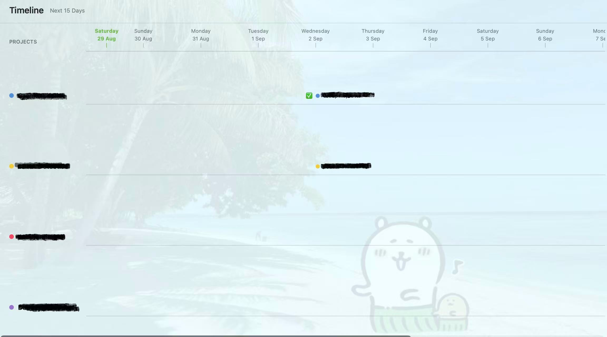
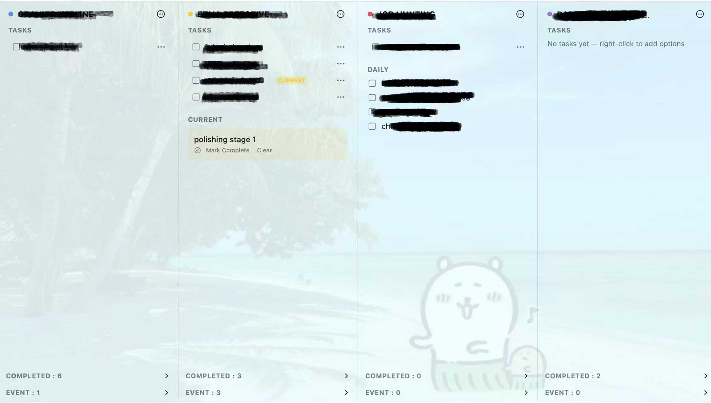

# Parallel Task Manager

Parallel Task Manager is a macOS task manager for people who need to manage several workstreams at the same time.

When multiple projects and deadlines start competing for your attention, Parallel Task Manager gives them one shared workspace. Create multiple projects, add tasks to each project, and view their deadlines together on a shared timeline instead of switching between separate lists.

## Why use it?

- **Manage parallel projects** — keep tasks from multiple projects in one place.
- **Shared timeline** — see upcoming deadlines from different projects on one timeline.
- **Break down complex work** — add subtasks to major tasks and turn large pieces of work into smaller, actionable steps.
- **ADHD-friendly focus** — mark one task as the current task so your next action stays visible and easy to return to.
- **Customizable appearance** — choose project colors and change the app background with built-in palettes or a custom background image.
- **Local-first** — task data is stored locally on your Mac using SwiftData.

## Screenshots

<p align="center">
  
  
</p>

<p align="center"><em>Timeline and Projects views</em></p>

## Requirements

- macOS 26.0 or later
- Xcode 26 or a compatible Xcode version with the macOS 26 SDK

## Build and run

Clone the repository and open the Xcode project:

```bash
git clone https://github.com/learnerrayyy/parallel_task_manger.git
cd parallel_task_manger
open ParallelTaskManager.xcodeproj
```

In Xcode, select the `ParallelTaskManager` scheme and run it on **My Mac**.

### Command-line build

For a local unsigned debug build:

```bash
xcodebuild \
  -project ParallelTaskManager.xcodeproj \
  -scheme ParallelTaskManager \
  -configuration Debug \
  -sdk macosx \
  -derivedDataPath .build \
  CODE_SIGNING_ALLOWED=NO \
  build

open .build/Build/Products/Debug/ParallelTaskManager.app
```

### Signing and distribution

To run a signed build or distribute the app, open the project in Xcode and select your own Apple Developer Team under **Signing & Capabilities**. The project uses an App Group so the app and widget can share data. Replace the placeholder App Group ID in these files with an App Group registered to your team:

- `ParallelTaskManager/Shared/SharedModelContainer.swift`
- `ParallelTaskManager/ParallelTaskManager.entitlements`
- `ParallelTaskManagerWidget/ParallelTaskManagerWidget.entitlements`

Then select a signing team for both the app and widget targets and build or archive the project from Xcode.

## Privacy and repository hygiene

This repository contains source code and build configuration only. Local task data, SwiftData storage, Xcode user settings, build products, derived data, and local design-source files are excluded from version control.
